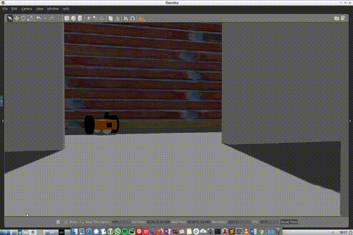
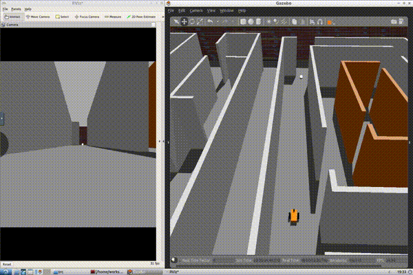

<!---->

# Robot Driven by Visual Input

> Creating a differential robot with a RGB camera sensor and lidar sensor to follow a key colour pattern.
> Capstone Project of the Robotics Software Engineer Nanodegree Program

With the help of Gazebo, a differential robot is created with a laser range finder sensor and a RGB camera. The setup is created in the Unified Robot Description Format **URDF**. After linking the robot parts together and defining joints for each wheel, the sensors with their respective physical capabilities are added to the robots definition. With the ROS framework, all the actors and sensors can be controlled.


---

## Table of Contents
- [Built With](#built-with)
- [Ball Chaser Package](#ball-chaser-package)
  - [Drive Bot Node](#drive-bot-node)
  - [Process Image Node](#process-image-node)

---

## Built With
The ROS workspace first needs to be initialized
```javascript
mkdir ~/catkin_ws/src/
cd ~/catkin_ws
catkin_init_workspace
```
afterwards, the repository can be cloned or downloaded and unzipped in the corresponding path. The packages can be compiled, and the environment has to be sourced.

```
catkin_make
source devel/setup.bash
```

Next, the robot is started inside the gazebo world, and the visualization program RVIZ is opened.

```
roslaunch my_robot myworld.launch
```

If the two programmes have opened up, the ball can be moved around and positioned in front of the robot. Next, the ball chaser package can be started.

```
roslaunch ball_chaser ball_chaser.launch
```

## Ball Chaser Package

Within the *ball_chaser* ROS package the captured image is analyzed to determine the position of the white ball. Then it commands the robot to orientate towards the ball and drive forward. Therefore the nodes inside the *ball chaser* package need to communicate with the central robot package and subscribe to the robot camera sensor and publish to the robot's joint wheels.

### Drive Bot Node

Inside the *ball_chaser* package the drive bot node is created, providing a service method to drive the robot around by setting its linear x and angular z velocities. The service server publishes messages containing the velocities for the wheel joints.


### Process Image Node

The second required node inside the *ball_chaser* package is the process image node. This client node will subscribe to the robot’s camera images and analyze them to determine the position of the optical colour key, a white ball. Once the ball position is determined, the client node requests a service from the drive_bot server node to drive the robot toward the ball. The robot can drive either left, right or forward, depending on the robot position inside the image.

---

